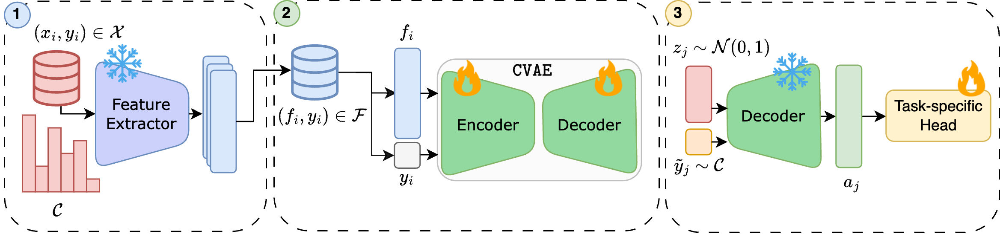

# Privacy-preserving datasets by capturing feature distributions with Conditional VAEs @ BMVC 2024
<p align="center">
    [<a href="https://arxiv.org/abs/2408.00639">Preprint</a>]
    [<a href="#citation">Bibtex</a>]
  </p>

**TL;DR**: This work introduces a novel approach using Conditional Variational Autoencoders (CVAEs) trained on feature vectors extracted from large pre-trained vision foundation models. Foundation models effectively detect and represent complex patterns across diverse domains, allowing the CVAE to faithfully capture the embedding space of a given data distribution to generate (sample) a diverse, privacy-respecting and potentially unbounded set of synthetic feature vectors.

<p align="center">
   
</p>

**Figure 1**: Given an image dataset $(x_i,y_i) \in \mathcal{X}$ with categorical class distribution $\mathcal{C}$, we first utilize a large pre-trained model to extract and store feature embeddings and corresponding labels $(f_i,y_i) \in \mathcal{F}$. These embeddings capture both local and contextual information while inherently reducing dimensionality. Subsequently, the embeddings are used during training of a Conditional Variational Autoencoder (CVAE) to capture the training distribution conditioned on the respective class labels $y_i$. Finally, we train a task-specific head while dynamically generating new synthetic feature vectors $a_j$ conditioned on class labels $\tilde y_j \sim C$ through CVAE's frozen decoder. This not only ensures data anonymity but also increases data diversity and model robustness.

#### 0. Preliminaries

```
conda env create -f environment.yaml
conda activate cvae
```

<details close>
<summary>More info about the medical datasets</summary>
<br> 

MedMNIST & MedIMeta:
```
mkdir assets/data/medmnist
mkdir assets/data/medimeta

cd assets/data/medmnist 
wget https://zenodo.org/records/10519652/files/breastmnist_224.npz

cd ../medimeta
wget https://zenodo.org/records/7884735/files/organs_axial.zip
wget https://zenodo.org/records/7884735/files/skinl_derm.zip
unzip organs_axial.zip -d .
unzip skinl_derm.zip -d .
cd ../../../
```

⚠️ OCTL: Download the dataset from [this](https://data.mendeley.com/datasets/sncdhf53xc/4) link and preprocess it using the script in `assets/data/octdl/octdl_preprocessing.py`.
</details>


#### 1. Create database

```
python create_db.py --dataset [dataset] --backbone [backbone]
```

It stores the database under `assets/database/[train|val|test].npz`

#### 2. Anonymize

```
python anonymize.py --dataset [dataset] \ 
                    --anonymizer [kSAME|cvae] \
                    --k [k, set if anonymizer == kSAME] \
                    --seed [random seed, set if anonymizer == cvae]
```

It stores the anonymized database under `assets/database/train_[anonymizer_id].npz`

#### 3. Train and Evaluate

```
python probing.py --dataset [dataset] \
                  --anonymizer [identity|kSAME|cvae] \
                  --k [k, set if anonymizer == kSAME] \
                  --seed [random seed] \
                  --output_root [where to store output logs]
```

To train and evaluate on noisy test embeddings, use the following instead:

```
# for kSAME
python probing_noise.py --dataset [dataset] \ 
                        --anonymizer [kSAME] \ 
                        --k [k] \
                        --seed [random seed] \
                        --sigma [standard deviation of the injected noise] \
                        --output_root [where to store output logs]
```

```
# for CVAE - online data generation
python probing_noise_cvae.py --dataset [dataset] \ 
                             --anonymizer [cvae-online] \ 
                             --variance [sampling variance of CVAE] \
                             --seed [random seed] \
                             --sigma [standard deviation of the injected noise] \
                             --output_root [where to store output logs]
```

### Citation

If you find this work useful, please consider citing us:

```
@article{disalvo2024privacy,
  title={Privacy-preserving datasets by capturing feature distributions with Conditional VAEs},
  author={Di Salvo, Francesco and David, Tafler and Doerrich, Sebastian and Ledig, Christian},
  journal={arXiv preprint arXiv:2408.00639},
  year={2024}
}
```

